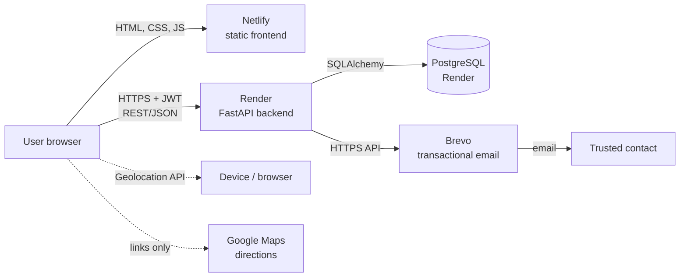
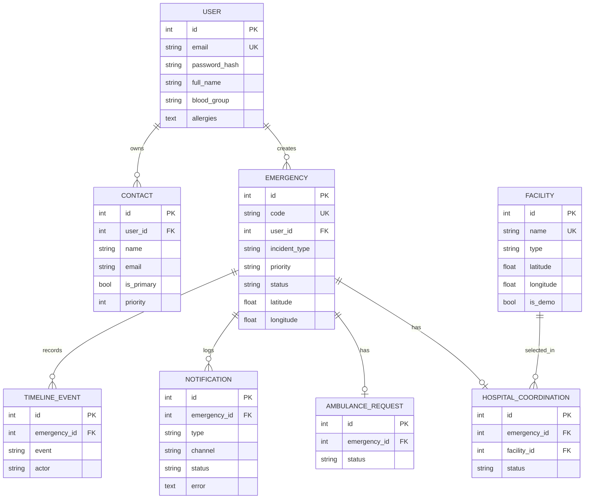
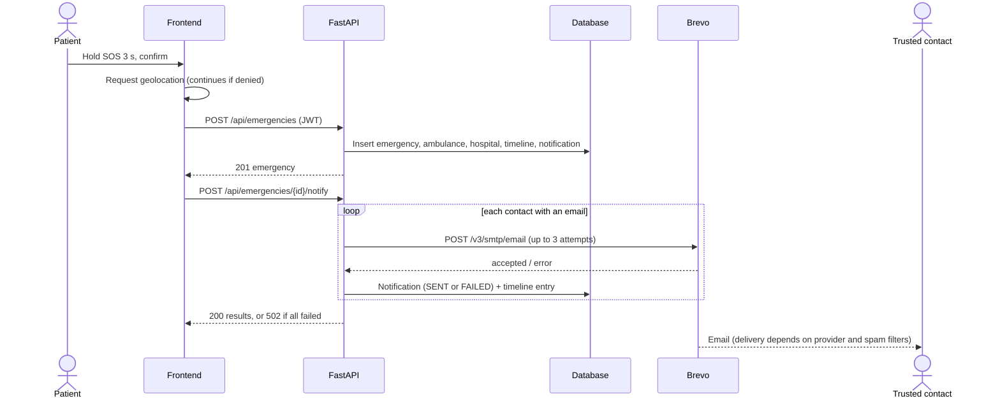
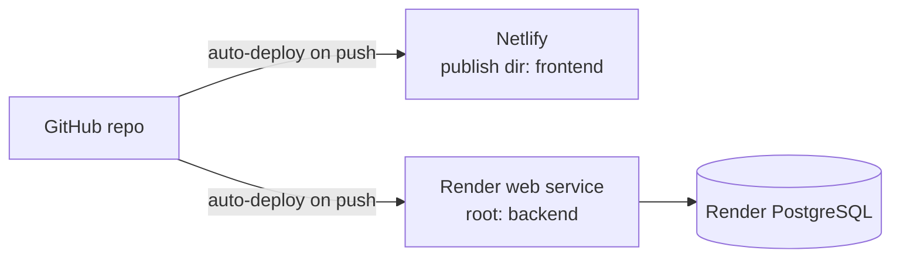
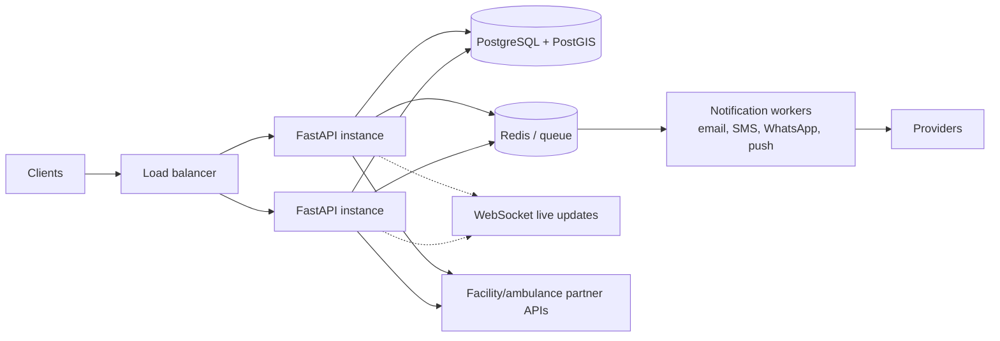

# MediBridge — Architecture

| | |
|---|---|
| **Version** | 0.2 (demo / pilot-ready prototype) |
| **Last updated** | 5 October 2026 |
| **Companion document** | [PRD.md](PRD.md) |

> MediBridge is a coordination aid. It does not contact government emergency services or dispatch ambulances.

---

## 1. System overview

MediBridge is a two-tier web application: a static multi-page frontend and a REST API backed by a relational database. Email is sent through an external provider.



Key properties:
- The frontend is static files. It holds no secrets and stores only the login token in the browser.
- All business state lives in the database and is reached only through the API.
- Every external call (email) has its real outcome stored and shown. Nothing is reported as successful unless it was.

## 2. Repository layout

```text
MediBridge/
├── frontend/
│   ├── config.js          # API_BASE (backend address)
│   ├── app.js             # shared: api(), shell(), toast, i18n, theme, geolocation
│   ├── style.css          # design tokens, light/dark, print rules
│   ├── login|register.html + auth.js
│   ├── dashboard.html + dashboard.js   # stats, SOS hold button
│   ├── emergency.html + emergency.js   # details, notify, coordination, timeline
│   ├── contacts.html  + contacts.js
│   ├── facilities.html + facilities.js # category search
│   └── history.html   + history.js
├── backend/
│   ├── app/
│   │   ├── main.py            # app, CORS, error handler, startup seed, /api/health
│   │   ├── database.py        # engine, session, DATABASE_URL normalisation
│   │   ├── models.py          # SQLAlchemy tables
│   │   ├── schemas.py         # Pydantic request/response models and enums
│   │   ├── auth.py            # hashing, JWT, current_user dependency
│   │   ├── seed_facilities.py # idempotent demo data
│   │   ├── routers/           # auth, contacts, emergencies, facilities
│   │   └── services/notify.py # email delivery (Brevo HTTPS or SMTP)
│   ├── tests/                 # pytest suite
│   ├── requirements.txt       # runtime + test dependencies
│   ├── requirements-prod.txt  # adds the PostgreSQL driver
│   └── .env.example
├── render.yaml                # optional Render Blueprint
├── PRD.md
└── ARCHITECTURE.md
```

## 3. Frontend

**Style:** plain HTML, CSS and JavaScript, one page per feature, no build step. Deployed as static files (Netlify publish directory `frontend`).

**Shared module (`app.js`)** is loaded on every page and provides:

| Function | Purpose |
|---|---|
| `api(path, options)` | `fetch` wrapper: adds the `Authorization` header, parses errors (string, validation array, or object), converts network failures into a readable message, logs out on 401 |
| `shell(page)` | Redirects to login if no token, loads the current user via `/api/auth/me`, renders header, language and theme controls, navigation, and the safety notice |
| `toast`, `esc`, `fmt` | Notifications (ARIA live region), HTML escaping, date formatting |
| `getPosition()` | Promise wrapper over the Geolocation API with friendly error messages |
| `T` / `t()` | Translation dictionary (en, hi, bn) — currently navigation and safety text |

**State:** the JWT is in `localStorage` (`mb_token`); theme and language are also stored there. There is no client-side data cache. Pages fetch fresh data on load and after each action.

**Security notes:** all dynamic text is escaped with `esc()` before insertion into HTML. The token is stored in `localStorage`, so any cross-site scripting bug would expose it — escaping and (later) a Content-Security-Policy are the defences.

**Main client flows**
- *SOS:* press-and-hold timer (3 s) using pointer and keyboard events → confirm dialog → geolocation (8 s timeout, creation proceeds without coordinates on failure) → `POST /api/emergencies` → redirect to the emergency page.
- *Emergency page:* loads the emergency, timeline, notifications and contacts in parallel; each action calls the API and then reloads the page data.
- *Facilities:* category buttons call `/api/facilities/nearby/search`; if empty, the client retries with a 200 km radius.

## 4. Backend

**Framework:** FastAPI with Pydantic validation and SQLAlchemy 2 ORM. Served by Uvicorn.

**Request path**

```text
Request → CORS middleware → router → dependency: current_user (JWT)
        → Pydantic validation → handler (ORM queries scoped to user)
        → response model → JSON
```

**Routers**

| Router | Responsibility |
|---|---|
| `auth` | register, login, current user |
| `contacts` | CRUD; enforces a single primary contact per user |
| `emergencies` | CRUD, notify, notifications, timeline, ambulance/hospital/coordination |
| `facilities` | list, nearby, filtered nearby search (requires login) |

**Startup (`main.py`):** creates tables with `create_all`, runs the idempotent demo-facility seed, configures CORS from `CORS_ORIGINS`, and registers a catch-all handler that logs the stack trace and returns a generic `500`.

**Error contract**

| Code | Meaning |
|---|---|
| 400 | Bad request (e.g. notify with no contact that has an email) |
| 401 | Missing, invalid or expired token; wrong login |
| 404 | Not found **or** belongs to another user |
| 409 | Duplicate registration email |
| 422 | Validation error (bad enum, out-of-range coordinates) |
| 500 | Unhandled error (logged, generic message) |
| 502 | Notification failed for every contact (per-contact errors returned) |

## 5. Data model



Notes:
- Deleting a user or emergency cascades to dependent rows.
- Statuses, priorities and incident types are stored as strings and validated against enums at the API boundary.
- Timestamps are stored as UTC.
- `Facility.is_demo` marks seeded data so the UI can label it unverified.

## 6. Authentication and authorization

- **Passwords:** PBKDF2-HMAC-SHA256, 200,000 iterations, 16-byte random salt, constant-time comparison.
- **Tokens:** HS256 JWT containing the user id (`sub`) and expiry (`ACCESS_TOKEN_EXPIRE_MINUTES`, default 60). The signing key is `SECRET_KEY`; the app refuses to issue or verify tokens without it.
- **Authorization:** the `current_user` dependency resolves the user from the token. Every emergency and contact query filters by `user_id`. A record owned by someone else returns `404`, which avoids revealing that the id exists.
- **Facilities** are reference data readable by any logged-in user.

## 7. Key flows

### 7.1 SOS to notification



### 7.2 Nearby facility search
1. Client sends `lat`, `lon`, `radius_km`, `type`, `emergency_only` (validated: latitude −90..90, longitude −180..180).
2. Server loads matching facilities, computes the great-circle (haversine) distance in Python, keeps those within the radius and sorts by distance.

## 8. Email delivery (`services/notify.py`)

| Mode | When | Transport |
|---|---|---|
| **Brevo HTTPS API** | `BREVO_API_KEY` and `SMTP_FROM_EMAIL` set | HTTPS (port 443) |
| **SMTP** | otherwise, if `SMTP_HOST`, `SMTP_PORT`, `SMTP_FROM_EMAIL` set | SMTP + STARTTLS |
| **None** | neither configured | returns "not configured" |

- Brevo is the production path because Render's free tier blocks outbound SMTP ports.
- `send_email` never raises. It returns `(ok, error, attempts)`, retrying up to 2 extra times.
- The sender address must be a verified sender in Brevo. A free-mail sender (Gmail) may be filtered to spam.
- Credentials are read from the environment and never logged.

## 9. Configuration

| Variable | Purpose |
|---|---|
| `SECRET_KEY` | JWT signing key (required) |
| `ACCESS_TOKEN_EXPIRE_MINUTES` | Token lifetime (default 60) |
| `DATABASE_URL` | Database; default is local SQLite. `postgres://` and `postgresql://` are normalised to `postgresql+psycopg2://` |
| `CORS_ORIGINS` | Comma-separated allowed frontend origins (no trailing slash) |
| `FRONTEND_URL` | Base URL used in links inside emails |
| `BREVO_API_KEY`, `SMTP_FROM_EMAIL`, `SMTP_FROM_NAME` | Email via Brevo |
| `SMTP_HOST`, `SMTP_PORT`, `SMTP_USE_TLS`, `SMTP_USERNAME`, `SMTP_PASSWORD` | Optional SMTP (local use) |
| `PYTHON_VERSION` | Render: `3.12.7` |

Frontend configuration is the single `API_BASE` value in `frontend/config.js`. Secrets are never committed (`.env` is git-ignored; `.env.example` holds placeholders only).

## 10. Deployment



| Component | Settings |
|---|---|
| **Render web service** | Root directory `backend`; build `pip install -r requirements-prod.txt`; start `uvicorn app.main:app --host 0.0.0.0 --port $PORT`; health path `/api/health` |
| **Render PostgreSQL** | Same region as the service; use the Internal Database URL |
| **Netlify** | Publish directory `frontend`; no build command |
| **Brevo** | Verified sender + API key |

Python 3.12 is pinned on Render so all dependencies have prebuilt wheels. `render.yaml` captures the same setup as a Blueprint.

## 11. Testing

- `pytest` with FastAPI's `TestClient` against a temporary SQLite database.
- The test setup blanks all email settings so tests never send real email, and mocks `send_email` for the success path.
- Covered: register/login/invalid login/duplicate, protected routes, invalid and expired tokens, emergency CRUD and cross-user isolation, validation errors, contacts CRUD, notify (no contact, not configured → 502 with a FAILED record, success), facility list/nearby/invalid coordinates/type filter, ambulance and hospital coordination.
- Not covered: browser/UI tests, load tests, real-provider integration.

## 12. Design decisions

| Decision | Reason | Trade-off |
|---|---|---|
| Vanilla JS multi-page frontend | Simple to deploy and read, no build step | More manual DOM code; no component reuse |
| FastAPI + SQLAlchemy | Typed validation, auto OpenAPI docs at `/docs` | — |
| Brevo HTTPS API for email | Works where SMTP is blocked; per-recipient result | Third-party dependency and daily quota |
| 404 instead of 403 for others' records | Does not reveal which ids exist | Slightly less explicit errors |
| Statuses recorded manually for ambulance/hospital | No provider integrations exist | Not real dispatch; UI says so |
| Seeded demo facilities | Makes the product demonstrable | Not verified; labelled DEMO |
| Standard-library PBKDF2 | No native build dependency on any platform | bcrypt/argon2 would be a stronger modern choice |

## 13. Known limitations and technical debt

1. **No database migrations.** `create_all` creates missing tables but never alters existing ones. Schema changes need Alembic or a database reset.
2. **Emergency code generation** uses a per-year count + 1. Deleting an emergency or two simultaneous creates can produce a duplicate code and a `500`. Use a database sequence or retry on conflict.
3. **Notifications are sent inside the request**, one contact at a time. Many contacts or a slow provider slows the response.
4. **Nearby search scans all facilities** in Python. Fine for tens or hundreds of rows; use PostGIS or a bounding-box query at scale.
5. **No rate limiting, email verification, password reset or audit log.**
6. **Token in `localStorage`** and no Content-Security-Policy yet.
7. **No pagination** on list endpoints.
8. **Translations** cover only navigation and the safety notice.
9. **Free-tier hosting:** the backend sleeps after idle time; the free database expires on 3 November 2026.
10. **Test key length** warnings (short test `SECRET_KEY`) are expected in tests; production must use a 32+ byte key.

## 14. Evolution path



Planned steps, in rough order:
1. Alembic migrations, sequence-based emergency codes, rate limiting, email verification and password reset.
2. Move notification delivery to a background queue with retry and delivery receipts; add a channel abstraction (email, SMS, WhatsApp, push).
3. Public read-only tracking link (signed, expiring token) for contacts.
4. Replace seeded facilities with a sourced dataset (e.g. OpenStreetMap) and a provider-ingest pipeline.
5. WebSockets for live status; PWA for installability.
6. Multi-organisation support (hospitals, ambulance providers, NGOs) with role-based access.